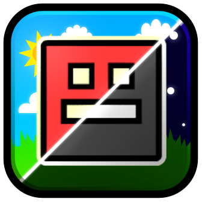
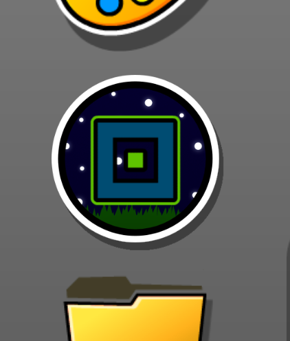

# Offline Icons
Set a custom icon set for when you're offline!

## How to use
You can customize your offline icon set in the _Icon Kit_. In the left of the Icon Kit, there should be a button that looks something like this:

Click that button to customize your offline icon set, and click it again to customize your normal icons

## Why?
I've seen some people set custom icon sets to indicate they're offline (heck, I myself did for a little while!). But it's pretty annoying having to remember to set your offline set every single time you go offline. This mod aims to fix that problem, making offline icon sets much more easier to set up

_made entirely in [neovim](https://neovim.io/) btw_
